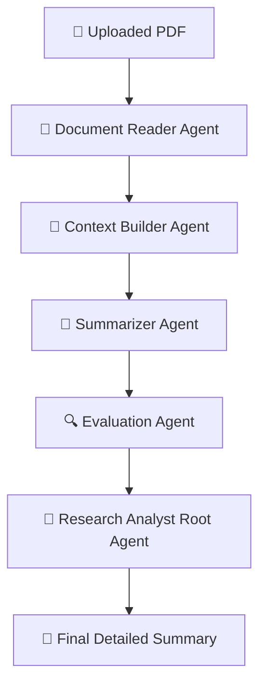

# Research_Paper_Analyst
A multi-agent system that reads research PDFs, builds context, searches the web, and generates a clear summary
---

## 🚀 Overview

This repository contains a **Google Colab–based implementation** of a **multi-agent AI system** that:

* Reads a research paper (PDF)
* Extracts meaningful sections (title, abstract, methods…)
* Builds a compressed context
* Generates a detailed explanation
* Evaluates the clarity + correctness
* Returns a **final structured summary**

This system is powered by:

* **Google Agent Development Kit (ADK)**
* **Gemini 2.0 Flash**
* **Tool-calling multi-agent orchestration**

Perfect for students, researchers, and developers who want automated paper summarization.


## 📦 Features

* ✔️ Full multi-agent pipeline
* ✔️ PDF → Markdown extraction
* ✔️ 500–700 word context builder
* ✔️ Detailed student-friendly summary
* ✔️ Summary evaluation agent
* ✔️ Clean, reproducible Colab notebook
* ✔️ No setup required except API key


## 🧠 Agentic Workflow

This project uses **five agents** that work together:

### 1️⃣ Document Reader Agent

Extracts clean Markdown sections from raw PDF.
(Title, Abstract, Introduction, Methods, Results, etc.)

### 2️⃣ Context Builder Agent

Compresses extracted content into a 500–700 word contextual summary.

### 3️⃣ Summarizer Agent

Generates an easy-to-understand explanation with sections like:
**Problem, Method, Data, Results, Key Takeaways**

### 4️⃣ Evaluation Agent

Checks the summary for clarity, correctness, and completeness.

### 5️⃣ Research Analyst Agent (Root Agent)

Controls all sub-agents, calls tools in correct order, and returns the final summary.


## 🔗 Agent Flow Diagram




## 📂 What’s Inside

```
📁 project/
├── README.md
├── multi_agent_pdf_summarizer.ipynb   ← main Colab notebook
└── sample_papers/                     ← optional PDFs
```


## 🔧 How to Use (Google Colab)

### **Step 1: Open the Notebook**

Click the Colab badge above.

### **Step 2: Add Your API Key**

Inside Colab:

```python
from google.colab import userdata
GOOGLE_API_KEY = userdata.get('GOOGLE_API_KEY')
os.environ['GOOGLE_API_KEY'] = GOOGLE_API_KEY
```

OR manually:

```python
import os
os.environ["GOOGLE_API_KEY"] = "your_api_key_here"
```


### **Step 3: Upload Your PDF**

```python
from google.colab import files
uploaded = files.upload()  # select your PDF file
```


### **Step 4: Extract Raw Text**

```python
from pypdf import PdfReader

def extract_pdf_text(path):
    reader = PdfReader(path)
    pages = [page.extract_text() or "" for page in reader.pages]
    return "\n\n".join(pages)

raw_text = extract_pdf_text(list(uploaded.keys())[0])
```


### **Step 5: Run the Multi-Agent Pipeline**

```python
response = await runner.run_debug(raw_text)
```

View the final output:

## 📌 Output Format

The system generates a **well-structured summary** with:

* **Title**
* **Problem the Paper Solves**
* **Background / Motivation**
* **Method / Model Explanation**
* **Dataset / Inputs Used**
* **Results (if present)**
* **Strengths of the Approach**
* **Limitations**
* **Key Takeaways** (5–10 bullet points)
* **Overall Conclusion**

Length: **300–600 words**


## 📘 Example Snippet

```
## Title
Retrieval-Enhanced Transformer (RET)

## Problem
Large language models struggle with...

## Method
RET introduces a frozen retriever ...
```


## 📜 Requirements

* Google Colab
* Python 3.10+
* Gemini API Key
* Dependencies auto-installed in notebook:

  * `google-adk`
  * `pypdf`


