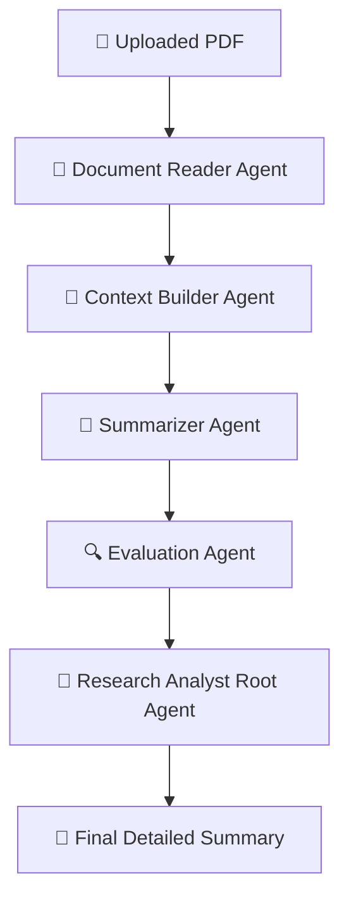

# 📄 Research_Paper_Analyst

### *A Multi-Agent System for Automated Research Paper Understanding Using Google Colab + Gemini + ADK*

This repository contains a **Google Colab–based multi-agent AI system** that reads research PDFs, extracts structure, builds context, summarizes the content, evaluates correctness, and returns a high-quality final explanation.

Built for:

* Students ✔️
* Researchers ✔️
* Capstone projects ✔️
* Automated literature reviews ✔️

---

# 🚀 Overview

This project implements a **complete multi-agent pipeline** using:

* **Google Agent Development Kit (ADK)**
* **Gemini 2.0 Flash**
* **Tool-calling agents**
* **PDF → Text → Markdown → Context → Summary → Evaluation**

The system runs **fully in Google Colab**, requires **no deployment**, and includes **memory** + **automatic session saving**.

---

# 📦 Key Features

### ✅ Full multi-agent architecture

### ✅ Local & GCS PDF reader tool

### ✅ Structured document extraction (Markdown)

### ✅ 400–600 word context builder

### ✅ 300–600 word detailed summary generator

### ✅ Automatic quality evaluator

### ✅ Session memory with `load_memory` & `preload_memory`

### ✅ Auto-save memory callback

### ✅ Perfect for capstone / academic documentation

### ✅ Zero infrastructure — runs only in Colab

---

# 🧠 Agentic Multi-Agent Workflow

The system uses **five agents** working together:

---

## **1️⃣ Document Reader Agent**

Transforms raw PDF text into clean, structured Markdown:

* Title
* Authors
* Abstract
* Sections
* Equations
* Tables

> No summarization — only formatting and cleanup.

---

## **2️⃣ Context Builder Agent**

Compresses structured content into a **dense, technical 400–600 word context** without losing meaning.

---

## **3️⃣ Summarizer Agent**

Creates a **student-friendly summary** with:

* Title
* Problem
* Background
* Models / Methods
* Data Used
* Results
* Strengths
* Limitations
* Key Takeaways (5–10 bullets)
* Final Conclusion

---

## **4️⃣ Evaluation Agent**

Checks the summary for:

* Technical correctness
* Completeness
* Clarity

Returns **short bullet-point feedback**.

---

## **5️⃣ Research Analyst (Root Agent)**

The controller that:

* Calls the PDF tool
* Routes outputs between sub-agents
* Uses evaluator feedback
* Returns final polished summary
* Uses long-term memory for preferences

---

# 🔗 Agent Flow Diagram



---

# 🔧 How to Use (Google Colab)

## ✅ Step 1 — Add Your Gemini API Key

```python
import os
from google.colab import userdata

GOOGLE_API_KEY = userdata.get('GOOGLE_API_KEY')
os.environ["GOOGLE_API_KEY"] = GOOGLE_API_KEY
```

Or manually:

```python
os.environ["GOOGLE_API_KEY"] = "your_key_here"
```

---

## ✅ Step 2 — Upload Your PDF

```python
from google.colab import files
uploaded = files.upload()
pdf_path = list(uploaded.keys())[0]
```

---

## ✅ Step 3 — Extract Raw Text (Optional)

```python
from pypdf import PdfReader

def extract_pdf_text(path):
    r = PdfReader(path)
    return "\n\n".join(page.extract_text() or "" for page in r.pages)

raw_text = extract_pdf_text(pdf_path)
raw_text[:500]
```

---

## ✅ Step 4 — Create the Agent (from your code)

Your Colab notebook writes:

```
%%writefile research_agent/agent.py
<your entire agent code>
```

Make sure to run that cell.

---

## ✅ Step 5 — Run the Multi-Agent System

```python
from research_agent.agent import runner

response = await runner.run_debug(
    user_id="capstone_user",
    session_id="session1",
    new_message=raw_text
)
```

---

# 📌 Output Format

The system returns a **clean, structured, accurate summary** with:

### **📘 Title**

### **🎯 Problem**

### **📚 Background**

### **⚙️ Methods / Models**

### **📊 Dataset / Inputs**

### **📈 Results**

### **⭐ Strengths**

### **⚠️ Limitations**

### **🔑 Key Takeaways (5–10 bullets)**

### **🧾 Final Conclusion**

**Length:** ~300–600 words
**Style:** Student-friendly, technically correct
**No hallucinations**
**Evaluator-improved summary**


---

# 📁 File Structure

```
research_agent/
│
├── agent.py      # Multi-agent system (root + reader + context + summary + eval)
└── __init__.py
```

---

# 👨‍💻 Tech Stack

* Python 3.10+
* Google Colab
* Gemini 2.0 Flash (via Google GenAI SDK)
* Google ADK (Agent Development Kit)
* pypdf for PDF parsing
* InMemorySessionService
* InMemoryMemoryService
* AgentTool wrappers

---

# 📜 Requirements

Your Colab notebook auto-installs:

```
google-adk
pypdf
google-cloud-storage
google-genai
```

Just ensure:

```
pip install google-adk google-cloud-storage pypdf google-genai
```

---

# 🏁 Conclusion

This project is a **complete multi-agent research analysis system** suitable for:

✔️ Capstone projects
✔️ AI/ML coursework
✔️ Automated literature review
✔️ Students learning LLM tool-calling
✔️ Practical agent-based AI systems


